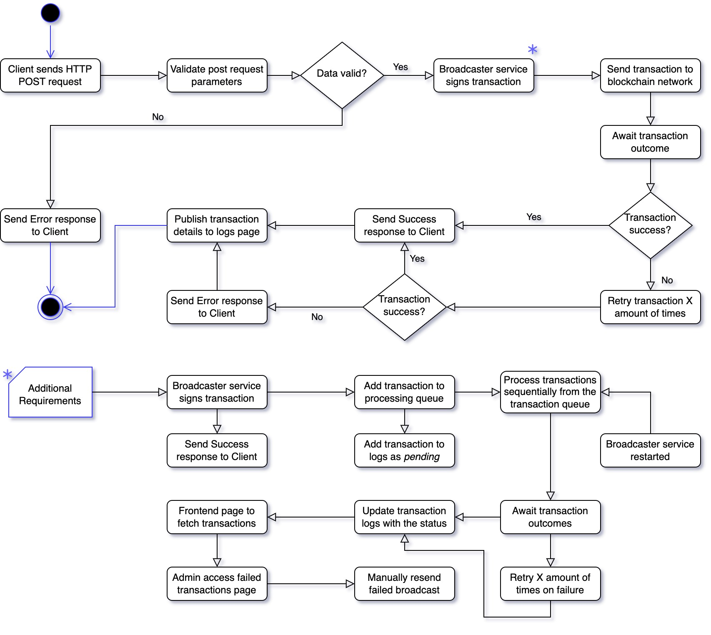

# Problem 6: Transaction Broadcaster Service

This is a system design question. Describe in detail (~500-1000 words) the specifications on how you would design a transaction broadcaster service. You may additionally attach a drawings/diagrams/illustrations if you wish.

## General Requirements

1. A `/broadcast_transaction` API endpoint to receive `HTTP POST` requests
2. A service to sign the transaction `data` received from  the `HTTP POST` requests
3. Broadcast of the `signed transaction` to the EVM compatible blockchain network
4. A response to the request client of Success `HTTP 200` or Failure `HTTP 400-500`
5. A Page to show the list/log of all transaction regardless passed or failed

## Additional Requirements
1. Client to assume that `HTTP 200` response transactions will eventually succeed
2. Broadcaster service to resume processing even after unexpected server restarts
3. Admin should be able to manually trigger retries for failed transactions

 

## Solution Flowchart

## Solution Flow Part 1
This solution assumes a more sequential flow of processing:  

1. The client sends the `HTTP POST` request to the API endpoint
2. The endpoint service immediately processes and signs transaction
3. Transaction is broadcasted to blockchain, awaiting the outcome
4. On failure, the broadcast service will retry the transaction again
5. Once an outcome is reached, a response is send to the client
6. Transaction status and details are logged for the page display

The **assumption** of the first flow is that the calling client uses a non-blocking process, 
and hence would likely have a response callback handler for whether the transaction was success 
or otherwise. Given the high success rate and relatively short waiting times, we have decided to 
handle the transaction proccessing immediately when the API is called to give quick finality. 

## Solution Flow Part 2 
This solution attempts to incorporate the *Additional Requirements* while addressing the shortcomings of Part 1.

1. Instead of processing immediately, transactions are added to a processing queue
2. Once added to queue, the transaction status is *pending* and will be braodcasted 
3. At this point, we can send `HTTP 200` to the client as per the given requirements
4. The transactions are then processes sequentially asynchronous of the calling client
5. If the broadcaster service every restarts, it will pick back up from the stored queue
6. As the transaction outcomes are received, they will update status and retry as needed 
7. All transaction logs and details and status can all be access from the frontend page
8. Admin can always login to the admin panel to manually retry any failed transactions

The **assumption** of the second flow, is that the client process is not dependant on the outcomes
of the transaction, and hence we can process them asynchronously. The transaction statuses can be 
accessed on the page at a later time. This way, the transactions can be retried again in the case 
of failures or service downtimes, and the admin can also do manual resends of transactions. 

## Possible Considerations
1. **Data Validation:** we should look to do some server-side data verification to catch any `data` errors
2. **Limited Retries:** we need to limit the number of retries to avoid clogging up the processing queue 
3. **Sequential Execution:** it is not clear whether there is only 1 wallet, or 1 per calling client account
    * Item 3a

5. Nounce no parallel same wallet??
6. Gas fees updated
7. Access control

